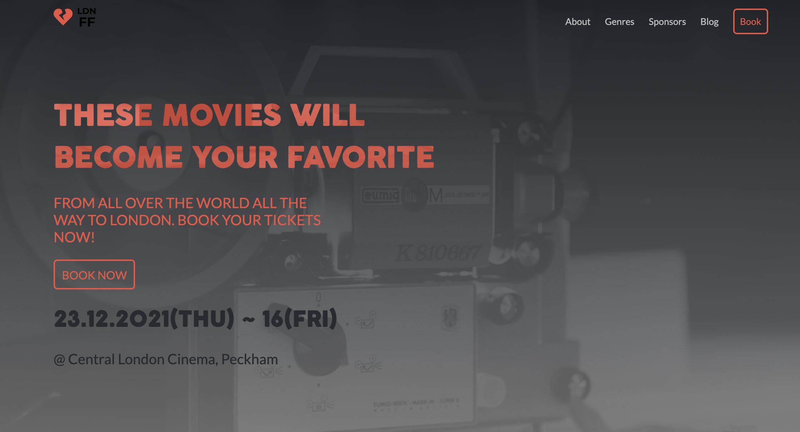

# Portfolio

> LDN Film Festival 2021 Website.

### Home page desktop:


## Objective:

- Showcase the project.
- Let users explore the website on all devices.
- Tell about the LDN Film Festival.
- Let users see the genres of the festival.
- Let users see the supporters of the festival.

## Built With

- HTML
- SCSS
- JavaScript

## Live Demo

[Live Demo Link](https://anuarshaidenov.github.io/LDN-film-fest/)

## Installation

1. Clone the repository using

```
git clone https://github.com/anuarshaidenov/LDN-film-fest.git
```

2. cd into the cloned repository

```
cd LDN-film-fest
```

3. You now have the access to the files on your local machine!

#### Optional steps

Install the node_modules/ folder to be able to locally run the linter commands. Run:

```
npm install
```

To check Webhint linter errors run:

```
npx hint .
```

To check Stylelint linter errors run:

```
npx stylelint "**/*.scss"
```

To check ESLint errors run:

```
npx eslint .
```

## Author

- GitHub: [@anuarshaidenov](https://github.com/anuarshaidenov)
- Twitter: [@anuarnyi](https://twitter.com/anuarnyi)
- LinkedIn: [LinkedIn](https://www.linkedin.com/in/anuar-shaidenov-365a951b8/)

## 🤝 Contributing

Contributions, issues, and feature requests are welcome!

Feel free to check the [issues page](https://github.com/anuarshaidenov/LDN-film-fest/issues).

## Show your support

Give a ⭐️ if you like this project!

## Acknowledgments

Original design idea by [Cindy Shin in Behance.](https://www.behance.net/gallery/29845175/CC-Global-Summit-2015)


## 📝 License

This project is [MIT](./MIT.md) licensed.
